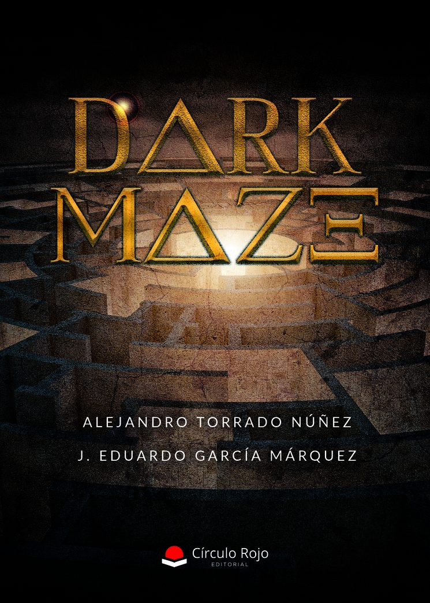

*****El Tesoro de los 10.000 Reyes:
El Tesoro de los 10.000 Reyes es una odisea trepidante donde la ambición se mezcla con el peligro y la gloria aguarda a quienes se atrevan a reclamarla. Nuestros héroes han hallado un objeto legendario, perdido en el tiempo y codiciado por todos, que promete conducirlos hasta la mayor riqueza jamás soñada: el mítico Tesoro de los 10.000 Reyes.

Pero el camino no será sencillo. Entre mares embravecidos y tormentas desatadas, se verán obligados a luchar contra despiadados piratas, criaturas marinas surgidas de las profundidades y horrores mitológicos como las implacables Gorgonas. Cada desafío será un salto hacia lo
imposible, cada victoria, un paso más en su carrera hacia la inmortalidad. Bajo la mirada vigilante de los dioses, entre el estruendo de espadas y el rugido de las olas, solo los valientes escribirán su nombre en la leyenda. El tesoro aguarda… ¿te atreves a
reclamarlo?

Troya: El Eco de una Victoria
¡Escuchad, hijos de Terramagna! Diez años lleva ardiendo esta guerra, y en ella han caído millares de hombres. Los troyanos, amparados tras sus murallas, aún resisten; vosotros, hambrientos de gloria, teméis perecer sin alcanzar la inmortalidad. Mas he visto lo que está escrito en las entrañas del destino…
¡Un augurio! Mientras la Espada de Troya permanezca en la ciudad, sus muros no caerán. La victoria solo será vuestra si os internáis en la necrópolis, lugar de sombras y silencio eterno. Allí aguardan guardianes implacables y un enigma que solo los más valientes podrán desvelar. Id, pues, hijos míos. Enfrentad la oscuridad, desafiad a la muerte misma y ganad el derecho a que vuestro nombre sea eterno. Si triunfáis, la gloria os abrazará; si fracasáis, vuestros cuerpos
serán polvo, pero vuestro sacrificio quedará grabado en el eco de la victoria.

La Ciudad Misteriosa:
Los héroes abandonan su poblado con una misión urgente: encontrar a su exploradora amazona, desaparecida sin dejar rastro. Sus pasos los conducen hasta los confines de lo desconocido, donde surge ante ellos una ciudad misteriosa, envuelta en sombras y secretos que desafían la lógica. Allí, el tiempo no fluye como en el mundo mortal; segundos se alargan, recuerdos se mezclan y lo real se confunde con lo imposible. Cada calle, cada edificio, cada sombra oculta un enigma, y la presencia de la amazona perdida es solo un hilo que guía a los valientes a través de esta red de ilusiones.
Los héroes deberán enfrentarse a trampas temporales, criaturas extrañas y las propias paradojas del tiempo para descubrir qué sucedió y, quizá, rescatar aquello que parecía perdido para siempre. En la Ciudad Misteriosa, nada es lo que parece, y cada decisión puede alterar el destino.

El Néctar de los Dioses: 
En lo alto del Olimpo, los dioses guardan celosamente un secreto: el néctar divino, esencia inmortal que otorga poder, gloria y vida eterna. Durante siglos, los mortales solo han oído susurros de su existencia, incapaces de imaginar su sabor ni sus dones. Sin embargo, un fragmento de esa verdad ha caído en manos de los héroes, encendiendo una búsqueda que pondrá a prueba su valor y ambición.
Para alcanzarlo, deberán cruzar tierras prohibidas, enfrentar criaturas mitológicas que protegen el camino y desafiar los designios de los propios dioses, que no toleran el robo de su más preciado tesoro. El néctar promete elevarlos a la eternidad, pero también puede condenarlos a la furia de los inmortales.
¿Serán capaces de reclamar el don prohibido o se perderán en el intento, dejando su nombre escrito solo como un eco en la historia.
Forjada al Amanecer La tierra de Terramagna se consume poco a poco bajo un oscuro ritual de sombras que, con cada amanecer, devora un fragmento más de su luz. Los héroes han recibido una misión sagrada: portar una espada recién nacida en la fragua del alba, la única capaz de romper el ciclo de tinieblas. Su viaje los conducirá a través de montañas prohibidas, desiertos interminables y mares embravecidos, mientras fuerzas oscuras acechan en cada esquina para impedir que cumplan su destino. Criaturas mitológicas, siervos de la sombra y enemigos disfrazados de aliados pondrán a prueba su valor y su fe.
En el extremo más lejano de Terramagna los aguarda el corazón del ritual, donde la espada deberá alzarse contra la oscuridad eterna. El futuro del mundo pende de su filo, y solo el amanecer decidirá si sus nombres brillarán en la gloria o se perderán en la nada. 

Poder y Rebeldía:
En los confines del mundo, donde la oscuridad se vuelve eterna, yace el Tártaro, prisión forjada por los dioses para encadenar a los titanes. Durante siglos, su furia ha sido contenida, sus gritos ahogados bajo capas de roca y fuego. Pero no todos los mortales aceptan el orden divino.
Un grupo de Prometanos, herederos del espíritu de la rebelión, ha jurado desafiar a los olímpicos y descender hasta las profundidades prohibidas. Su propósito: quebrar las cadenas del Tártaro y devolver a los titanes la libertad robada. El camino hacia las entrañas del mundo estará plagado de pruebas imposibles, criaturas ancestrales y trampas tejidas por los dioses para preservar su reinado. Sin embargo, la llama
de la rebeldía arde más fuerte que el miedo. ¿Lograrán cambiar el destino y levantar a los titanes, o quedarán sepultados como mártires en la oscuridad eterna?

Sucedió en Rakotis:
En la ciudad de Rakotis, el descanso se ha vuelto un lujo prohibido. Nadie puede dormir sin pagar tributo a dos hermanos sátiros, astutos y codiciosos, que han erigido un faro capaz de robar la esencia de quienes cierran los ojos, llenando sus noches de pesadillas interminables. Mientras los habitantes sufren, los sátiros acumulan riquezas vendiendo una pócima que permite no dormir por una noche, ofreciendo una tregua temporal frente al tormento que ellos
mismos han creado. Nuestros héroes deberán enfrentarse a esta extraña tiranía, descubrir los secretos del faro y desafiar a los gemelos antes de que la ciudad quede consumida por el miedo y la desesperación. Entre trampas, ilusiones y pesadillas vivientes, cada decisión será crucial para liberar a Rakotis y devolverle la paz perdida, antes de que el poder de los sátiros se vuelva irrompible.

Oda a la Muerte 2:
Un viejo comediante, cansado de la rutina de la vida mortal, se encuentra con Nyx, la insondable diosa de la oscuridad. Ante él, un desafío imposible: tocar la canción más hermosa del mundo, o su alma sería devorada por la sombra eterna. Guiado por el miedo y la pasión por la música, logra arrancar lágrimas a la diosa con su melodía, ganándose su favor. Como recompensa, Nyx le entrega un regalo sin igual: un Arpa poderosa, capaz de devolver la vida a quien él desee, otorgándole el poder de cumplir un último deseo imposible.
Ahora, los héroes deberán acompañar al comediante en un viaje donde cada nota de su arpa puede salvar o condenar, enfrentándose a fuerzas oscuras, misterios antiguos y dilemas morales que desafían la esencia misma de la vida y la muerte. El tiempo se agota, y el último acto está por comenzar.
=====FIN======
